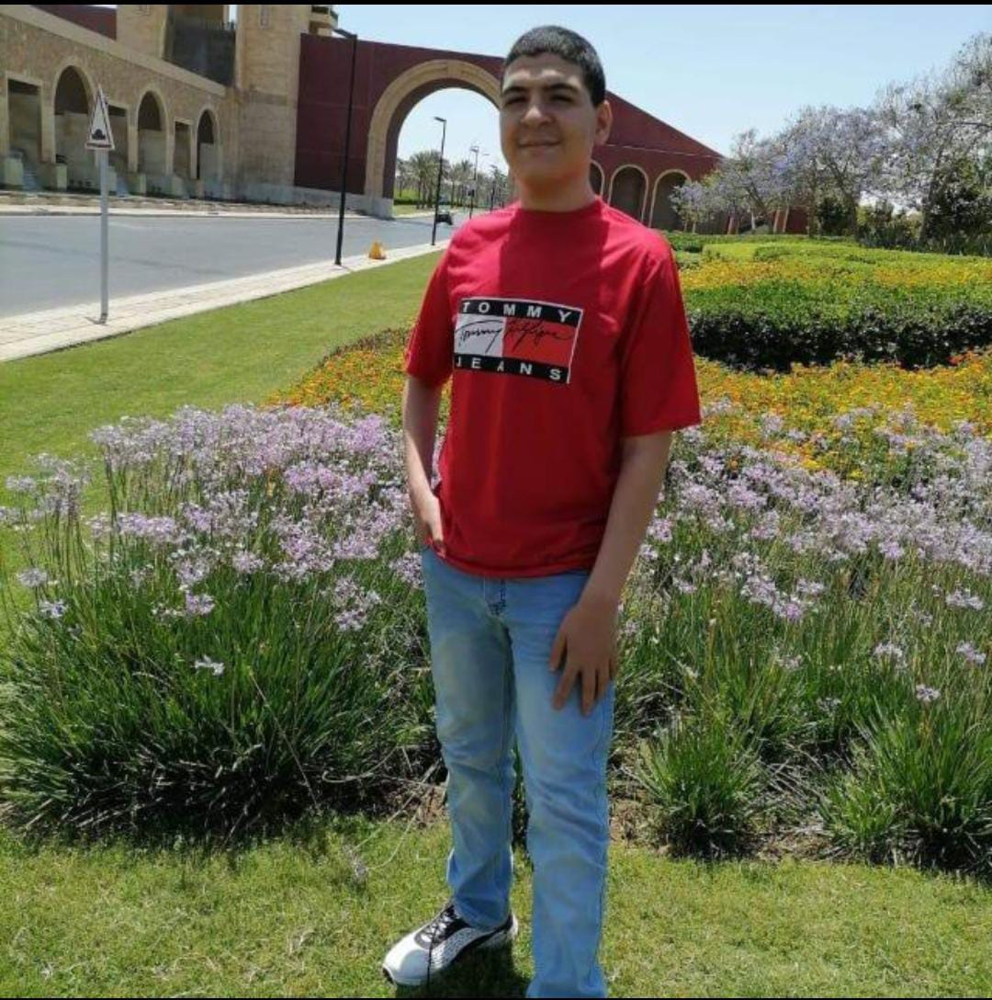

<!DOCTYPE html>
<html lang="en">
<head>
    <meta charset="UTF-8">
    <meta name="viewport" content="width=device-width, initial-scale=1.0">
    <title>Monarmez </title>
    <link rel="preconnect" href="https://fonts.googleapis.com">
    <link rel="stylesheet" href="https://cdnjs.cloudflare.com/ajax/libs/font-awesome/6.4.2/css/all.min.css">
    <link rel="stylesheet" href="style.css">

</head>
<body>

        <nav>
            

                

                    
                

                

                    <i class="fa-solid fa-sun" ></i>
                    <a href="#">Dark-mode</a>
                

                

                    <i class="fa-solid fa-magnifying-glass"></i>
                    <a href="#">Search</a>
                

                

                    <i class="fa-regular fa-user"></i>
                    <a href="#">Profile</a>
                

                

                    <i class="fa-solid fa-server"></i>
                    <a href="#">Hostting</a>
                

                

                    <i class="fa-regular fa-comments"></i>
                    <a href="#">Communities</a>
                

                

                    <i class="fa-sharp fa-solid fa-laptop"></i>
                    <a href="#">Code lab</a>
            
                

            

        </nav>
        

            

                

                    

                        
                    

                   

                     <i class="fa-regular fa-heart"></i>
                     <i class="fa-regular fa-paper-plane"></i>
                   

                

               

                

                    

                        

                            

                             

                                 
                             

                             

                                ahmed

                            <i class="fa-solid fa-certificate"></i>
                              . 1h 
                            

                            <i class="fa-solid fa-grip-lines"></i>
                         

                         

                            
                         

                         

                            

                                <i class="fa-regular fa-heart"></i>
                                <i class="fa-regular fa-message"></i>
                                <i class="fa-regular fa-paper-plane"></i>
                            

                                <i class="fa-regular fa-bookmark"></i>
                         

                         

                                
liked by ahmed and others

                                

                                    mohamedgood work 

                                
 see all comments

                         

                    

                    

                        

                            

                             

                                 
                             

                             

                                eyad

                             <i class="fa-solid fa-certificate"></i>
                              . 1d 
                            

                            <i class="fa-solid fa-grip-lines"></i>
                         

                         

                            
                         

                         

                            

                                <i class="fa-regular fa-heart"></i>
                                <i class="fa-regular fa-message"></i>
                                <i class="fa-regular fa-paper-plane"></i>
                            

                                <i class="fa-regular fa-bookmark"></i>
                         

                         

                                
liked by mo and other

                                

                                   moyou can go to settings  

                                
view all

                         

                    

                    

                        

                            

                             

                                 
                             

                             

                                 mohamed

                             <i class="fa-solid fa-certificate"></i>
                              . 5h 
                            

                            <i class="fa-solid fa-grip-lines"></i>
                         

                         

                            
                         

                         

                            

                                <i class="fa-regular fa-heart"></i>
                                <i class="fa-regular fa-message"></i>
                                <i class="fa-regular fa-paper-plane"></i>
                            

                                <i class="fa-regular fa-bookmark"></i>
                         

                         

                                
liked by mai and other

                                

                                    maigreat  

                                
 view all

                         

                    

                    

                        

                            

                             

                                 
                             

                             
holland
                                

                             <i class="fa-solid fa-certificate"></i>
                              . 5d 
                            

                            <i class="fa-solid fa-grip-lines"></i>
                         

                         

                            
                         

                         

                            

                                <i class="fa-regular fa-heart"></i>
                                <i class="fa-regular fa-message"></i>
                                <i class="fa-regular fa-paper-plane"></i>
                            

                                <i class="fa-regular fa-bookmark"></i>
                         

                         

                                
liked by ahmed and other

                                

                                    ahmedcongratulation  

                                
 view all

                         

                    

                    

                        

                            

                             

                                 
                             

                             

                               sia

                             <i class="fa-solid fa-certificate"></i>
                              . 1w 
                            

                            <i class="fa-solid fa-grip-lines"></i>
                         

                         

                            
                         

                         

                            

                                <i class="fa-regular fa-heart"></i>
                                <i class="fa-regular fa-message"></i>
                                <i class="fa-regular fa-paper-plane"></i>
                            

                                <i class="fa-regular fa-bookmark"></i>
                         

                         

                                
liked by mohamed and others

                                

                                     hollandvery good  

                                
 view all

                         

                    

                    

                        

                            

                             

                                 
                             

                             

                                taylor swift

                             <i class="fa-solid fa-certificate"></i>
                              . 7d 
                            

                            <i class="fa-solid fa-grip-lines"></i>
                         

                         

                            
                         

                         

                            

                                <i class="fa-regular fa-heart"></i>
                                <i class="fa-regular fa-message"></i>
                                <i class="fa-regular fa-paper-plane"></i>
                            

                                <i class="fa-regular fa-bookmark"></i>
                         

                         

                                
liked by mai and other

                                

                                     maicongratulation  
                                 waelcongrats

                                
 view all

                         

                    

                    

                        

                            

                             

                                 
                             

                             

                                the tribal chief

                             <i class="fa-solid fa-certificate"></i>
                              . 6d 
                            

                            <i class="fa-solid fa-grip-lines"></i>
                         

                         

                            
                         

                         

                            

                                <i class="fa-regular fa-heart"></i>
                                <i class="fa-regular fa-message"></i>
                                <i class="fa-regular fa-paper-plane"></i>
                            

                                <i class="fa-regular fa-bookmark"></i>
                         

                         

                                
Liked by sara and others

                                

                                    markgood job  

                                
view all

                         

                    

                    

                        

                            

                             

                                 
                             

                             

                               mark

                             <i class="fa-solid fa-certificate"></i>
                              .6 d 
                            

                            <i class="fa-solid fa-grip-lines"></i>
                         

                         

                            
                         

                         

                            

                                <i class="fa-regular fa-heart"></i>
                                <i class="fa-regular fa-message"></i>
                                <i class="fa-regular fa-paper-plane"></i>
                            

                                <i class="fa-regular fa-bookmark"></i>
                         

                         

                                
Liked by the tribal chief and others

                                

                                    the tribal chief very good  

                                
 view all

                         

                    

                   

                         
                    
                    

                        

                            

                             

                                 
                             

                             

                                         ali

                             <i class="fa-solid fa-certificate"></i>
                              . 5d 
                            

                            <i class="fa-solid fa-grip-lines"></i>
                         

                         

                            
                         

                         

                            

                                <i class="fa-regular fa-heart"></i>
                                <i class="fa-regular fa-message"></i>
                                <i class="fa-regular fa-paper-plane"></i>
                            

                                <i class="fa-regular fa-bookmark"></i>
                         

                         

                                
Liked by sara and others

                                

                                    mohamed how you make it  

                                
 view all comments

                         

                    

                

           

           

                

                    

                        

                            
                        

                        

                            
eyad adel

                            
friend

                        

                    

                    <a href="#" class="follow">switch</a>
                

                 

                    
suggestion

                    <a href="#" class="see-all">All</a>
                 

                 

                    

                        

                            
                        

                        

                            
john cena

                            
new 

                        

                    

                    <a href="#" class="follow">follow</a>
                

                

                    

                        

                            
                        

                        

                            
mahmoud saleh

                            
two followed +2
                            

                        

                    

                    <a href="#" class="follow">followed</a>
                

                

                    

                        

                            
                        

                        

                            
ahmed mahmoud

                            
new 
                            

                        

                    

                    <a href="#" class="follow">follow</a>
                

                

                    

                        

                            
                        

                        

                            
ali ahmed

                            
new

                            

                        

                    

                    <a href="#" class="follow">follow</a>
                

                

                    

                        

                            
                        

                        

                            
abo bakr

                            
new

                        

                    

                    <a href="#" class="follow">follow</a>
                

                
 @All rights reserved by monarmez

           

        

  </body>
</html>
